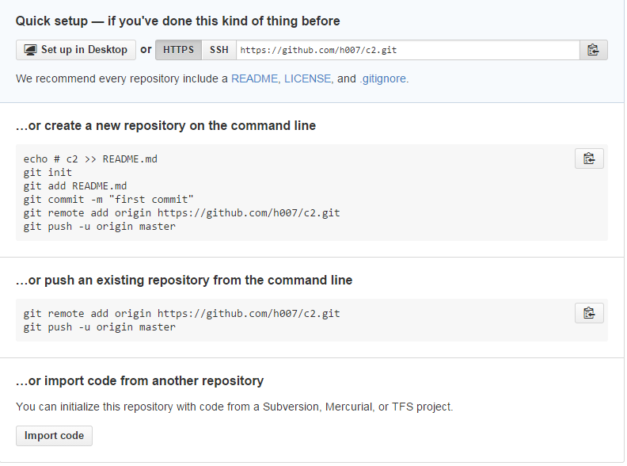

http://www.bootcss.com/p/git-guide/  
```
注意上面链接中所提到的工作目录是指你在本地**已经**保存的文件

```


```
…or create a new repository on the command line
echo # c2 >> README.md(window git touch README.md)
git init
git add README.md
git commit -m "first commit"
git remote add origin https://github.com/h007/c2.git
git push -u origin master
…or push an existing repository from the command line


git remote add origin https://github.com/h007/c2.git
git push -u origin master
…or import code from another repository
```

[diff1](http://www.cnblogs.com/cspku/articles/Git_cmds.html)  
[diff2](http://www.cnblogs.com/wish123/p/3963224.html)
